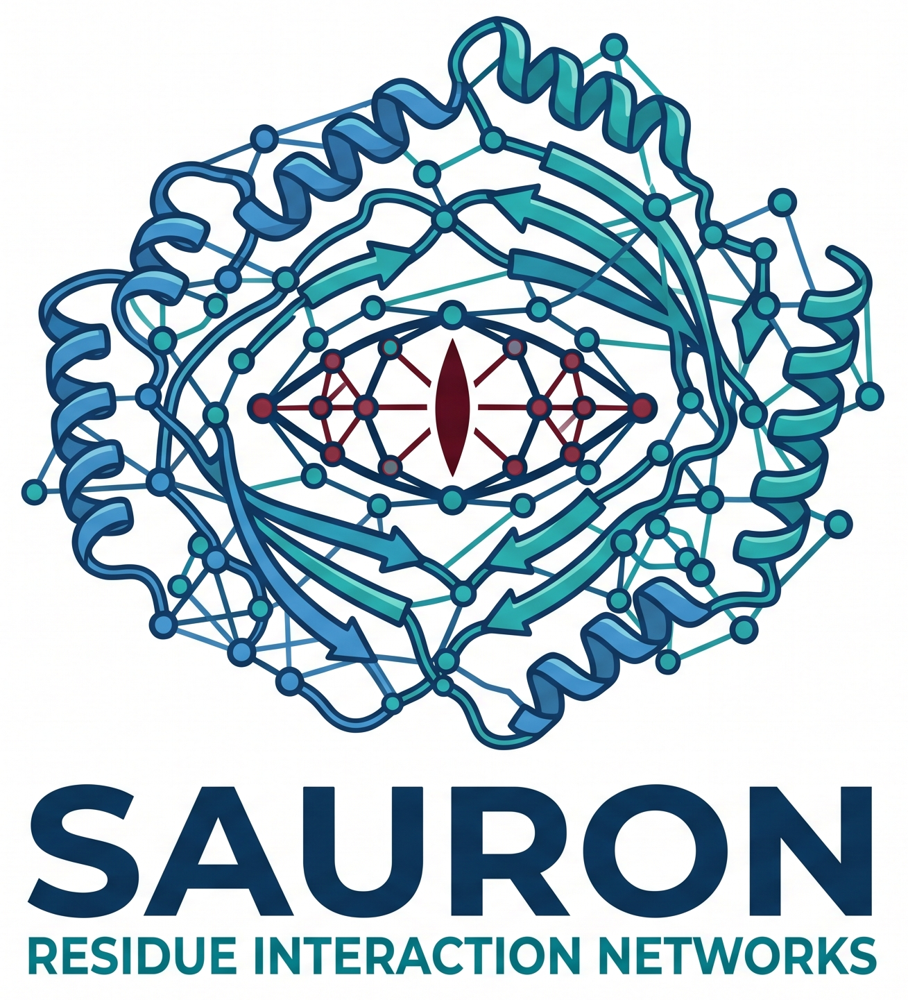
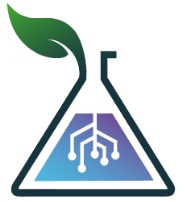

<div align="center">
  
</div>

# Sauron

Sauron is a Residue Interaction Network (RIN) Calculator that identifies and maps intra-molecular interactions in protein structures. It analyzes PDB and MMCIF files to calculate interactions such as hydrogen bonds, salt bridges, disulfide bonds, and van der Waals contacts, outputting node and edge files perfectly suited for network analysis. 

Sauron is designed to align with established standards, providing strict geometry controls and graph-based topological metrics.

<div align="center">
  
</div>

Developed by the EvoMol-lab Team, BioMe, UFRN.

## Features

- **Multiple Interaction Types**: Calculates SSBOND, IONIC (salt bridge), PIPISTACK, PICATION, HBOND, and VDW interactions.
- **Topological Metrics**: Automatically computes network properties including Degree, Clustering Coefficient, Betweenness Centrality, and Eigenvector Centrality.
- **Advanced 3D Web Dashboard**: Explore the network through a 3D force-directed graph perfectly synchronized with a structural viewer (PDBe Molstar).
- **Direct Database Fetching**: Instantly calculate networks by providing an RCSB PDB ID or an AlphaFold UniProt ID.
- **Versatile Calculation Methods**: 
  - *Standard*: A fast and strictly constrained distance/angle algorithm.
  - *Voronoi*: Applies Voronoi Tessellation to compute topological neighbor interactions with high sensitivity, circumventing reliance on fixed cutoffs.
  - *ProDy InSty*: A robust atomic-level interaction detector that captures complex interactions (like Pi-Stacking and Cation-Pi) while dynamically subtyping bonds (e.g. `MC_MC`, `SC_MC`, `SC_SC`).
- **Rigorous Filters**: 
  - Restrict calculations to specific chains.
  - Optionally enforce strict >120° angle constraints for Hydrogen Bonds.
  - Remove multiple/redundant interactions of the same type between the same residue pair.
- **Hydrogen Normalization**: Built-in `pdb2pqr` wrapper to add explicit hydrogens, which is critical for enhancing the accuracy of hydrogen-bond calculators and ProDy parsing.
- **Strict Compatibility**: Guarantees legacy `RING` compatibility for rendering downstream networks across all methodologies.
- **Container Ready**: Easily deployable via Docker, Podman, and Apptainer/Singularity.

## Requirements

The core dependencies are listed in `requirements.txt`. Key packages include:
- `biopython`
- `networkx`
- `pandas`
- `numpy`
- `Flask` (for the web interface)
- `requests` (for fetching remote structures)
- `pdb2pqr` (optional, for explicit hydrogen addition)
- `pydssp` (optional, for secondary structure assignment)

To install dependencies:
```bash
pip install -r requirements.txt
```

Alternatively, you can run Sauron within a container (see Documentation for Docker and Apptainer details).

## Usage

### 1. Command-Line Interface (CLI)

You can run Sauron directly on any PDB or CIF file.

```bash
python sauron.py <input_file> [options]
```

**Options:**
- `--calc-method`: Choose the interaction calculation methodology (`standard`, `voronoi`, or `insty`). Default is `standard`.
- `--add-h`: Add explicit hydrogens using `pdb2pqr` prior to calculations (Highly recommended for `insty` runs).
- `--strict-angle`: Enforce strict angle constraints for Hydrogen Bonds (e.g. >120°).
- `--remove-multiples`: Remove multiple interactions of the same type between the same residue pair.
- `--chains`: Comma-separated list of chains to calculate (e.g., A,B,C).

**Example:**
```bash
python sauron.py 1AFW.pdb --add-h --strict-angle --remove-multiples --chains A
```

### 2. Web Interface

Sauron includes a beautiful, interactive web interface for uploading files, fetching from databases, and visualizing the 3D network.

Start the Flask server:
```bash
python SauronGUI.py
```
Then, open your browser and navigate to `http://localhost:5000`. 
Drag and drop your PDB/CIF file or fetch directly from RCSB/AlphaFold, toggle your desired parameters, and click "Calculate Network" to visualize and download your results.

For more detailed information, please see `DOCUMENTATION.md`.

## Container Deployment

Sauron can be easily deployed via containers, bypassing the need to install Python dependencies manually.

### Docker / Podman
Build and run the image using the provided `Dockerfile`:
```bash
docker build -t sauron-gui .
docker run -p 5000:5000 -v $(pwd)/uploads:/opt/sauron/uploads sauron-gui
```
*(The `-v` flag mounts a local `uploads` directory so you can access the downloaded `.zip` output files easily.)*

### Apptainer / Singularity
Build and run the image using the provided `Apptainer.def` file (ideal for HPC environments):
```bash
apptainer build sauron.sif Apptainer.def

export SAURON_UPLOAD_DIR=/tmp/sauron_uploads
mkdir -p $SAURON_UPLOAD_DIR
apptainer run --bind $SAURON_UPLOAD_DIR:/opt/sauron/uploads sauron.sif
```

## Google Colab Notebook

You can also run Sauron in Google Colab without installing anything. Click the badge below to open the notebook in Google Colab and start using it immediately.

[](https://colab.research.google.com/drive/1gNwkodDXqh3cRf-X7c34P6tslo89kbDF#scrollTo=Y4dnVbJFFH-f)

>*Fetching the structures from databases and the visualization features are not available in the Colab notebook.*

## Output Files

For a given input `structure.pdb`, Sauron generates:

- **`structure.edges`**: A list of all identified interactions (edges) between residues, including interaction type, distance, and angle.
- **`structure.nodes`**: A list of all residues (nodes) in the structure, including chain, position, DSSP secondary structure, and 3D coordinates.
- **`structure_network_metrics.tsv`**: Full topological network metrics for every node in the structure.
- **`structure_top25_metrics.tsv`**: A summary table of the top 25 nodes ranked by different centrality measures.

If the file contains multiple models, Sauron will generate these outputs individually for each model (`structure_model_1.edges`, etc.).

## Artificial Intelligence Disclosure
The authors used generative AI technologies for code auditing and performance optimization (Gemini® and GitHub-CoPilot®). Throughout this process, the authors maintained full control over the tool's design and interpretation of its results; the AI acted solely as a technical and linguistic aid. All AI-generated content was reviewed and approved by the authors, who take full responsibility for the final tool.

## Citing Sauron

If you use Sauron in your research, please cite the Sauron's GitHub repository. The preprint information is coming soon.

## License

This project is licensed under the MIT License - see the [LICENSE](LICENSE) file for details.

<div align="center">
  
</div>
